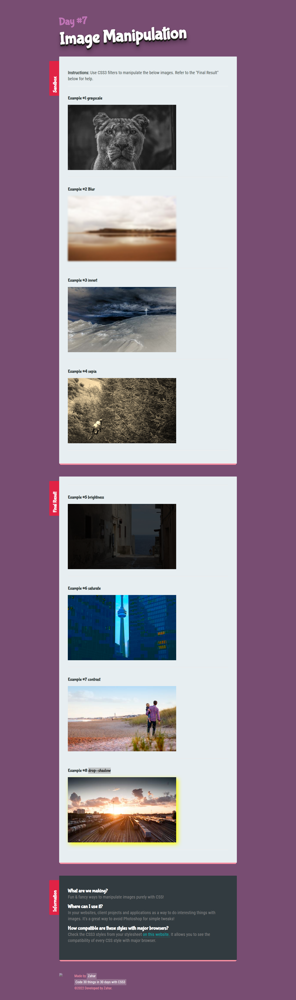

# filter-css3
https://zaharsm.github.io/filter-css3/

Image Manipualtion using CSS3 FILTER ===>
filter: none | blur() | brightness() | contrast() | drop-shadow() | grayscale() | hue-rotate() | invert() | opacity() | saturate() | sepia() | url();

